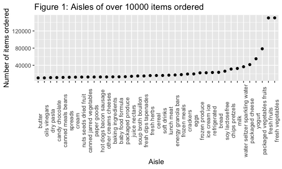

p8105\_hw3\_hw2849
================
hw2849
2021.10.13

``` r
library(tidyverse)
library(p8105.datasets)
data("instacart")
data("brfss_smart2010")
```

## Problem 1

``` r
instacart %>% 
  group_by(aisle_id) %>% 
  
  ## count for how many aisles and orders in each aisle
  summarize(order_counts = n()) %>% 
  
  ## ranking aisles by the number of orders
  mutate(ranking = min_rank(desc(order_counts))) %>% 
  
  ## find the aisle of the most items ordered from
  filter(min_rank(ranking) < 2)
```

    ## # A tibble: 1 × 3
    ##   aisle_id order_counts ranking
    ##      <int>        <int>   <int>
    ## 1       83       150609       1

``` r
## A plot for aisles with 10000 more orders
plot_df = instacart %>% 
  group_by(aisle_id) %>% 
  count(aisle_id, name = "orders_over_10000") %>% 
  filter(orders_over_10000 > 10000) 

  ggplot(plot_df, aes(x = aisle_id, y = orders_over_10000)) + 
    geom_point()
```

<!-- -->

``` r
## A table for three most popular items in “baking ingredients”, “dog food care”, and “packaged vegetables fruits”
table = instacart %>% 
  group_by(aisle) %>% 
  filter(
    aisle %in% c("baking ingredients", 
                 "dog food care", 
                 "packaged vegetables fruits")
    ) %>% 
  count(product_name, name = "counts") %>% 
  mutate(
    ranking = min_rank(desc(counts))
  ) %>% 
  filter(ranking < 4)

table
```

    ## # A tibble: 9 × 4
    ## # Groups:   aisle [3]
    ##   aisle                      product_name                         counts ranking
    ##   <chr>                      <chr>                                 <int>   <int>
    ## 1 baking ingredients         Cane Sugar                              336       3
    ## 2 baking ingredients         Light Brown Sugar                       499       1
    ## 3 baking ingredients         Pure Baking Soda                        387       2
    ## 4 dog food care              Organix Chicken & Brown Rice Recipe      28       2
    ## 5 dog food care              Small Dog Biscuits                       26       3
    ## 6 dog food care              Snack Sticks Chicken & Rice Recipe …     30       1
    ## 7 packaged vegetables fruits Organic Baby Spinach                   9784       1
    ## 8 packaged vegetables fruits Organic Blueberries                    4966       3
    ## 9 packaged vegetables fruits Organic Raspberries                    5546       2

``` r
## A table for mean hour of the day Pink Lady Apples and Coffee Ice Cream
table_mean_hour = instacart %>% 
  group_by(product_name, order_dow) %>% 
  filter(
    product_name %in% c("Pink Lady Apples", "Coffee Ice Cream")
      ) %>% 
  summarize(
    mean_hour = mean(order_hour_of_day)) %>% 
  
 ##??  lubridate::wday(order_dow + 1)   
## mutate(order_dow = wday(order_dow + 1))
 
pivot_wider(
  names_from = order_dow,
  values_from = mean_hour
)
```

    ## `summarise()` has grouped output by 'product_name'. You can override using the `.groups` argument.

``` r
table_mean_hour
```

    ## # A tibble: 2 × 8
    ## # Groups:   product_name [2]
    ##   product_name       `0`   `1`   `2`   `3`   `4`   `5`   `6`
    ##   <chr>            <dbl> <dbl> <dbl> <dbl> <dbl> <dbl> <dbl>
    ## 1 Coffee Ice Cream  13.8  14.3  15.4  15.3  15.2  12.3  13.8
    ## 2 Pink Lady Apples  13.4  11.4  11.7  14.2  11.6  12.8  11.9

First, we have 1384617 observations with 15 variables in `instacart`
dataset, which including user ids, product names, product aisles, aisles
numbers, the day of the week and the hour of the day on which the order
was placed.

There are 134 aisles, and the most items ordered from aisle 83, which is
fresh vegetables. The plot shows the number of items ordered in aisles
that are more than 10000 items ordered.

The table shows three most popular items in aisles “baking ingredients”,
“dog food care”, and “packaged vegetables fruits”. For example,top three
popular items of “baking ingredients” are light brown sugar, pure baking
soda, and cane sugar.

The last table summarizes the mean hour of the day that “Pink Lady
Apples” and “Coffee Ice Cream” are ordered on each day of the week. For
instance, the mean hour at “Coffee Ice Cream” are ordered on day “3” is
15.31818.

## Problem 2

``` r
## Data cleaning on `Overall Health` topic
health_data_df = brfss_smart2010 %>% 
  janitor::clean_names() %>% 
  rename(state = locationabbr, county = locationdesc) %>% 
  group_by(topic) %>% 
  filter(topic == "Overall Health") %>% 
  mutate(response = factor(response, levels = c("Poor", "Fair", "Good", "Very good", "Excellent"))) %>% 
  arrange(response, .by_group = TRUE) 
```

``` r
## 7 or more locations of a state observed in 2002
observation_2002 = health_data_df %>% 
  filter(year == "2002") %>% 
  count(state, name = "state_counts") %>% 
  filter(state_counts >= 7)

## 7 or more locations of a state observed in 2010
observation_2010 = health_data_df %>% 
  filter(year == "2010") %>% 
  count(state, name = "state_counts") %>% 
  filter(state_counts >= 7)
```

In this problem, we focused on the topic of ‘Overall Health’. Firstly,
changed the variable names, for example, ‘locationabbr’ was changed into
‘state. Then, values of variable ’response’ was reordered in levels of
{Poor, Fair, Good, Very good, Excellent}.

Looking at the data frame, in 2002, there were 36 states were observed
at 7 or more locations. However, in 2010, there were 45 states were
observed.
